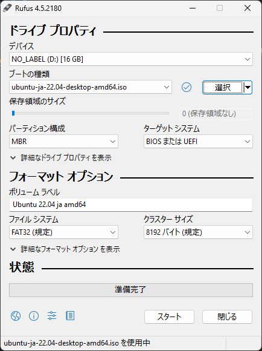
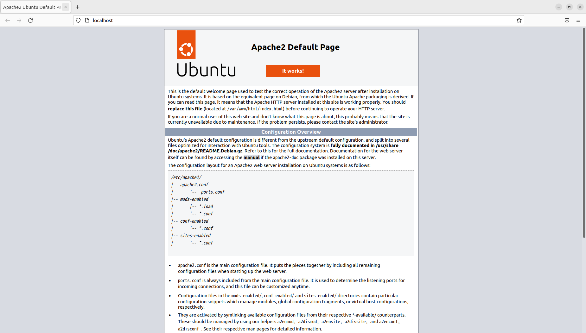
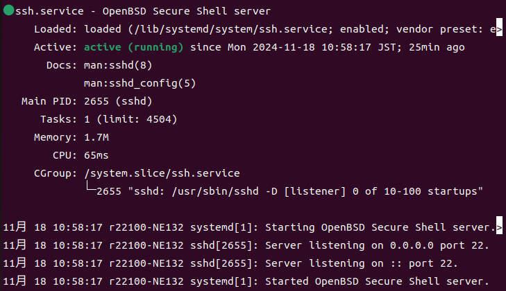
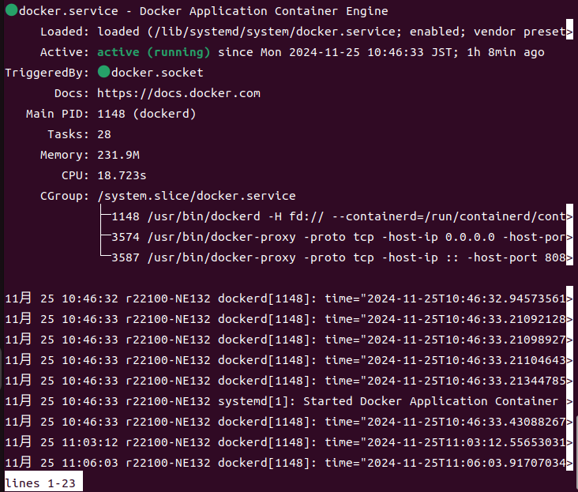
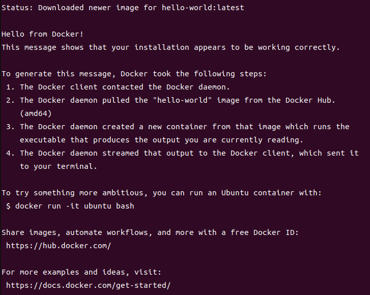
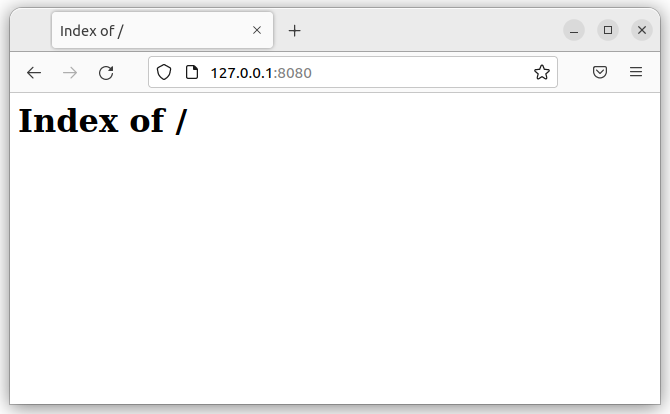

# サーバー構築　手順書
## 環境
- PC: Gateway ME132-F14P
- OS: Ubuntu 22.04 

# 1. OSのインストール
## ダウンロード
- [Ubuntu_22.04_LTS](https://www.ubuntulinux.jp/download/ja-remix)をダウンロード
- ブータブルUSBを作成するため、[Rufus](https://rufus.ie/ja/)をダウンロード
### (任意)ハッシュ値の確認
以下のコマンドをPowerShellで実行
```ハッシュ値の確認
certutil -hashfile <isoファイルのパス> sha256
```
Ubuntuをダウンロードしたページにある`SHA256SUMS`の値と同じであることを確認
## ブータブルUSBの作成
画像1.1のようにrufusを実行する<br>
フォーマットオプションは初期状態で問題ない<br>
<br>
画像1.1　Rufusの設定
## インストール
### UEFIの設定
- 電源導入直後に(筆者の環境の場合)F2キーを押下
- `Boot`から`Boot priority order`を変更
- `USB HDD: Generic Flash Disk`を一番上に持ってくる<br>
  画像の状態でF6を押下すると1つ上に来る。
- `Exit`から`Exit Saving Changes`を選択し、変更を保存し終了

### Ubuntuのインストール
UEFIの設定を終えると、黒い画面が表示される<br>
一番上の`Try or Install Ubuntuを選択`
流れに沿ってインストールする
- `Ubuntuをインストール`を選択
- キーボードレイアウトを選択
- 選択したら`続ける`を選択
- Wi-Fiの設定をする。
- アップデートと他のソフトウェアの設定
  - デフォルトの設定で問題ない
- インストールの種類を選択
  - 今回はディスクを削除してのインストールを行うが、データが消えるため注意が必要である。
- タイムゾーンの選択
  - 日本在住であれば`Tokyo`を選択
- ユーザー名・パスワードなどを設定
  - コンピューターの名前は何でも良い
- 再起動する

しばらく待つ

- 再起動後、USBを外す
- 起動できないため、一度電源を切り、UEFIを起動する。
- UEFIの`Security-Set Supervisor password`を選択
  - 一時的なパスワードを入れる(何でも良い)
- `Select an UEFI file as tursted for executing`を選択
- `EMMC` → `EFI` → `ubuntu` → `shimx64.efi`の順に選択
  - ubuntu と名付ける
- パスワードを空に戻す
- Save and exitをする

Ubuntuが起動する。

<!--
以下を実行
sudo apt update
sudo apt upgrade
-->

# 2. Webサーバの構築
## Apache HTTP Serverのインストール
Apache HTTP Serverは、以下Apacheと呼称する。
以下のコマンドを実行
```
sudo apt update
sudo apt install apache2
```
### Apacheの起動
```
sudo systemctl start apache2
sudo systemctl enable apache2
sudo systemctl status apache2
```

### Apacheの動作を確認
- [http://localhost](http://localhost) にアクセス<br>
画像2.1のようなページが表示される。<br>
<br>
画像2.1　Apache Default Page

## 仮想ホストの作成
### 設定ファイルの作成
以下のコマンドを実行<br>
`ファイル名`には任意のファイル名を代入
```
sudo touch /etc/apache2/sites-available/ファイル名.conf
```
### 設定ファイルの編集
設定ファイルに以下の内容を記述<br>
`ディレクトリパス`・`ファイル名`には任意のディレクトリパス・ファイル名を代入
```
<VirtualHost *:80>
	ServerAdmin webmaster@localhost
	DocumentRoot ディレクトリパス
	DirectoryIndex ファイル名
	ErrorLog ${APACHE_LOG_DIR}/error.log
	CustomLog ${APACHE_LOG_DIR}/access.log combined
</VirtualHost>
```

### ディレクトリの作成
以下のコマンドを実行
```
sudo mkdir -p ディレクトリパス
```

### ファイルの作成
以下のコマンドを実行
```
sudo touch ディレクトリパス/ファイル名
```
作成したファイルにページの内容を記述する

### 仮想ホストの有効化
以下のコマンドを実行
```
sudo a2ensite <ファイル名>.conf
sudo systemctl reload apache2
```

### デフォルトの仮想ホストの無効化
以下のコマンドを実行
```
sudo a2dissite 000-default.conf
sudo systemctl reload apache2
```

### ファイアウォールの有効化とポート開放
```
sudo ufw enable
sudo ufw allow ‘Apache Full’
```

## パスワード認証の設定
### apache2-utilsパッケージのインストール
以下のコマンドを実行
```
sudo apt install apache2-utils
```

### ユーザの登録
初回の場合、下のコマンドを実行
```
sudo htpasswd -c /etc/apache2/.htpasswd ユーザ名
```
2回目以降の場合、下のコマンドを実行
```
sudo htpasswd /etc/apache2/.htpasswd ユーザ名
```

### 設定ファイルの編集
仮想ホストの設定ファイルに認証のためのディレクティブを追加する<br>
以下の内容を追加
```
<Directory "認証を利用するディレクトリパス">
  AuthType Basic
  AuthName "Restricted Content"
  AuthUserFile /etc/apache2/.htpasswd
  Require valid-user
</Directory>
```

### Apacheの再起動
以下のコマンドを実行
```
sudo systemctl reload apache2
```

# 3. SSHサーバの構築
### OpenSSHのインストール
以下のコマンドを実行
```
sudo apt install openssh-server
```

### OpenSSHの起動を確認
以下のコマンドを実行
```
sudo systemctl ststus ssh
```
起動している場合、画像3.1のような出力がなされる。
<br>
画像3.1　期待される実行結果
### 起動していない場合
以下のコマンドを実行
```
sudo systemctl start ssh
sudo systemctl enable ssh
```

## ポート番号の設定
### 設定のバックアップファイルを作成
以下のコマンドを実行
```
sudo cp /etc/ssh/sshd_config /etc/ssh/sshd_config_backup
```

### ポート番号の設定
設定ファイル`/etc/ssh/sshd_config`から`#Port 22`記述されている行を探し、行頭にある`#`を削除し、`22`を任意のポート番号に変更する。
```
Port 任意のポート番号
```

### rootログインの禁止
設定ファイル`/etc/ssh/sshd_config`に、以下の行を追記
```
PermitRootLogin no
```

### sshの再読み込み
以下のコマンドを実行
```
sudo systemctl reload ssh
```

### ファイアウォールの設定
以下のコマンドを実行
```
sudo ufw allow 任意のポート番号/tcp
```

### SSHでのログイン
クライアントPCで、以下のコマンドを実行
```
ssh ユーザ名@ホスト名(もしくはIPアドレス) -p ポート番号
```

## 2段階認証の利用
### クライアントの公開鍵・秘密鍵生成
クライアントPCで以下のコマンドを実行
```
ssh-keygen -t ed25519 -f $HOME\.ssh\ファイル名
```

### 公開鍵の登録
クライアントPCで以下のコマンドを実行<br>
※必ず**公開鍵の**ファイル名を指定すること。
```
cat $HOME\.ssh\「公開鍵の」ファイル名 | ssh ユーザ名@ホスト名（もしくはIPアドレス） -p ポート番号 "mkdir -p ~/.ssh && chmod 700 ~/.ssh && cat >> ~/.ssh/authorized_keys && chmod 600 ~/.ssh/authorized_keys"
```

### 2段階認証のパラメータ追加
設定ファイル`/etc/ssh/sshd_config`に、以下の行を追記
```
AuthenticationMethods publickey,password
```

### sshの再読み込み
以下のコマンドを実行
```
sudo systemctl reload ssh
```

### 接続テスト
クライアントPCで、以下のコマンドを実行
```
ssh ユーザ名@ホスト名(もしくはIPアドレス) -p ポート番号 -i 秘密鍵のファイルパス
```

# 4. Dockerを使った環境構築や運用
### Dockerのインストール
以下のコマンドを実行
```
sudo apt-get update && sudo apt-get install ca-certificates curl && sudo install -m 0755 -d /etc/apt/keyrings && sudo curl -fsSL https://download.docker.com/linux/ubuntu/gpg -o /etc/apt/keyrings/docker.asc && sudo chmod a+r /etc/apt/keyrings/docker.asc
```

```
echo "deb [arch=$(dpkg --print-architecture) signed-by=/etc/apt/keyrings/docker.asc] https://download.docker.com/linux/ubuntu$(. /etc/os-release && echo "$VERSION_CODENAME") stable" | sudo tee /etc/apt/sources.list.d/docker.list > /dev/null
```

```
sudo apt-get update && sudo apt-get install docker-ce docker-ce-cli containerd.io docker-buildx-plugin docker-compose-plugin
```

### Dockerのバージョン確認と状態確認
以下のコマンドを実行
```
sudo docker --version
```
```
sudo systemctl status docker
```
<br>
画像4.1　期待される出力


### HelloWorldコンテナの起動
以下のコマンドを実行
```
sudo docker container run hello-world
```
<br>
画像4.2　期待される出力

## Dockerを用いたWebサーバの構築
### Webサーバ管理用のディレクトリの作成
以下のコマンドを実行
```
mkdir -p ディレクトリ名/htdocs ディレクトリ名/conf
```

### httpdコンテナの起動
`ディレクトリ名`のディレクトリで実行
```
sudo docker run -dit --name my-apache-app -p 8080:80 -v ./htdocs:/usr/local/apache2/htdocs/ -v ./conf:/usr/apache2/conf httpd:2.4
```


### コンテナの起動の確認
Webブラウザで`localhost:8080`にアクセス
<br>
画像4.3　期待される表示

# 参考文献
[【Windows】SHA256などのファイルハッシュ値を確認する方法](https://qiita.com/setonao/items/4e9edd3e2064c56507e4)